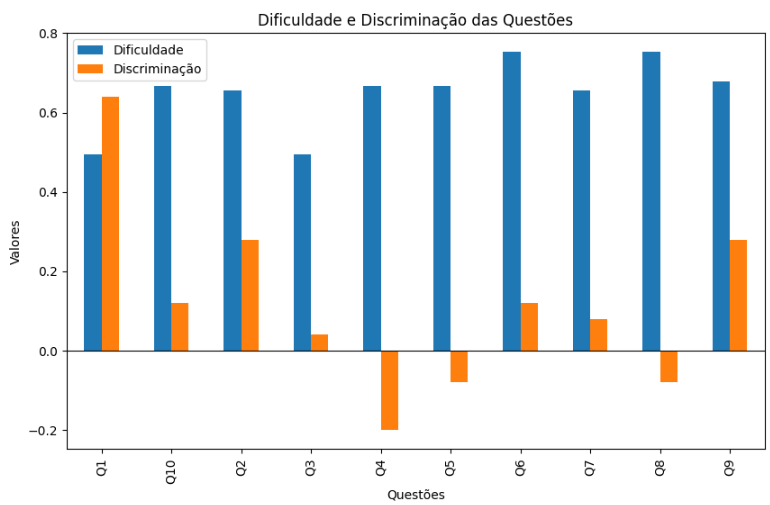

# Avaliação Educacional de Questões com Classical Test Theory (CTT)

## Objetivo
Projeto autoral em Python, utilizando NumPy, Pandas e Matplotlib, para aplicar técnicas da Classical Test Theory (CTT) na avaliação da qualidade de questões educacionais. A análise identifica itens fáceis ou difíceis, verifica sua capacidade de discriminar entre alunos de diferentes níveis de desempenho e gera interpretações automáticas para apoiar decisões pedagógicas.  
Base fictícia: 10 alunos e 100 questões.

## Pipeline
1. Importação de bibliotecas  
2. Carregamento da base de dados  
3. Cálculo da dificuldade (média de acertos por questão)  
4. Cálculo da discriminação (diferença entre grupos de alto e baixo desempenho)  
5. Interpretação automática (Boa, Fraca, Revisar)  
6. Visualização dos resultados (tabelas e gráficos)

## 1. Importação de bibliotecas
```python
# importando bibliotecas
import pandas as pd
import numpy as np
import matplotlib.pyplot as plt
```
## 2. Carregamento dos dados
```python
# carregando os dados
df = pd.read_csv("dados-simulados.csv")
print(df.head())
```
## 3. Cálculo da dificuldade (média de acertos por questão) 
```python
# calculando a dificuldade 
dificuldade = df.mean()
print(dificuldade)
```
| Questão | Dificuldade |
|---------|-------------|
| Q1      | 0.494624    |
| Q2      | 0.655914    |
| Q3      | 0.494624    |
| Q4      | 0.666667    |
| Q5      | 0.666667    |
| Q6      | 0.752688    |
| Q7      | 0.655914    |
| Q8      | 0.752688    |
| Q9      | 0.677419    |
| Q10     | 0.666667    |

**Interpretação:**
- valor próximo a 1.0: questão fácil
- valor próximo a 0.0: questão difícil
  
## Cálculo da discriminação (diferença entre grupos de alto e baixo desempenho)
```python
# calculando pontuação total de cada aluno
df["total"] = df.sum(axis=1)

# ordenando os alunos por total de pontos
df_sorted = df.sort_values("total")

# definindo os grupos inferior e superior
n = int(len(df) * 0.27)
grupo_inferior = df_sorted.iloc[:n]
grupo_superior = df_sorted.iloc[-n:]

# calculando a discriminação de cada questão
discriminacao = grupo_superior.mean() - grupo_inferior.mean()
print(discriminacao)
```
| Questão | Discriminação |
|---------|---------------|
| Q1      | 0.64          |
| Q2      | 0.28          |
| Q3      | 0.04          |
| Q4      | -0.20         |
| Q5      | -0.08         |
| Q6      | 0.12          |
| Q7      | 0.08          |
| Q8      | -0.08         |
| Q9      | 0.28          |
| Q10     | 0.12          |
| total   | 1.20          |

**Interpretação:**
- valores positivos: discriminação boa
- valores próximos de 0: discriminação fraca
- valores negativos: indica problema (os alunos fracos acertaram mais do que os alunos fortes)

## 5. Construção da tabela final
```python
# juntando resultados: dificuldade e discriminação
resultado = pd.DataFrame({
    "Dificuldade": dificuldade,
    "Discriminação": discriminacao
})

# removendo a linha "total"
resultado = resultado.drop("total", errors="ignore")
print(resultado)
```
| Questão | Dificuldade | Discriminação |
|---------|-------------|---------------|
| Q1      | 0.494624    | 0.64          |
| Q10     | 0.666667    | 0.12          |
| Q2      | 0.655914    | 0.28          |
| Q3      | 0.494624    | 0.04          |
| Q4      | 0.666667    | -0.20         |
| Q5      | 0.666667    | -0.08         |
| Q6      | 0.752688    | 0.12          |
| Q7      | 0.655914    | 0.08          |
| Q8      | 0.752688    | -0.08         |
| Q9      | 0.677419    | 0.28          |

**Interpretação:**
- Questões com alta dificuldade e baixa discriminação podem ser muito fáceis e pouco úteis. 
- Questões com baixa dificuldade e boa discriminação são boas para avaliações.
- Questões com discriminação negativas devem ser revisadas.

## 6. Visualização dos resultados
- **Gráfico "Dificuldade e Discriminação das Questões"**
```python
# criando gráfico
ax = resultado.plot(kind="bar", figsize=(10,6))
plt.title("Dificuldade e Discriminação das Questões")
plt.xlabel("Questões")
plt.ylabel("Valores")
plt.axhline(0, color = "black", linewidth = 0.8)
plt.legend(loc = "best")
plt.show()
```


- **Tabela Final com três indicadores principais: Dificuldade, Discriminação e Interpretação**

```python
# criando coluna de interpretação das questões

# criando função
# regras de interpretação: Boa: discriminação > 0.30 | Fraca: 0 < discriminação <= 0.30 | Revisar: discriminação <= 0
def interpretar_item(row):
    if row["Discriminação"] > 0.3:
        return "Boa"
    elif row["Discriminação"] > 0:
        return "Fraca"
    else:
        return "Revisar"

# aplicando função no dataframe
resultado["Interpretação"] = resultado.apply(interpretar_item, axis=1)

# visualizando tabela final
print(resultado)
```
| Questão | Dificuldade | Discriminação | Interpretação |
|---------|-------------|---------------|---------------|
| Q1      | 0.494624    | 0.64          | Boa           |
| Q10     | 0.666667    | 0.12          | Fraca         |
| Q2      | 0.655914    | 0.28          | Fraca         |
| Q3      | 0.494624    | 0.04          | Fraca         |
| Q4      | 0.666667    | -0.20         | Revisar       |
| Q5      | 0.666667    | -0.08         | Revisar       |
| Q6      | 0.752688    | 0.12          | Fraca         |
| Q7      | 0.655914    | 0.08          | Fraca         |
| Q8      | 0.752688    | -0.08         | Revisar       |
| Q9      | 0.677419    | 0.28          | Fraca         |

 
**Interpretação:**
- Dificuldade: indica se a questão é fácil (valor alto) ou difícil (valor baixo).  
- Discriminação: mostra se a questão diferencia bem os alunos de maior e menor desempenho.  
- Interpretação: classificação automática baseada nos valores de discriminação.

### Conclusão
Este projeto mostra como a CTT pode ser usada para avaliar a qualidade de questões em avaliações educacionais. A análise de dificuldade e discriminação, junto com uma interpretação automática, fornece um diagnóstico objetivo de cada questão, sendo possível apoiar decisões pedagógicas e melhorar a precisão na avaliação do desempenho dos alunos.
